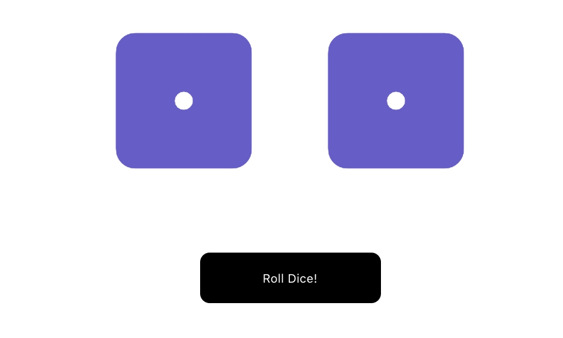

# Roll dices

## Description

Material component for rolling dice

**_DEMO:_**



## Usage / Install

Clone repo, cd into folder and run:

```console
$ npm install
$ npm start
```

## Requirement

- npm

## Tools

- Create-react-app cli

## Licence

[MIT](./LICENSE.txt)

## Author

[Shoe Kure](https://github.com/roy1210)
